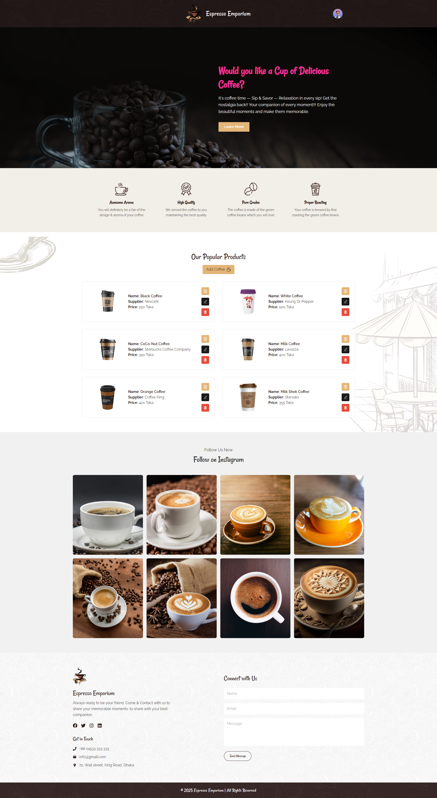
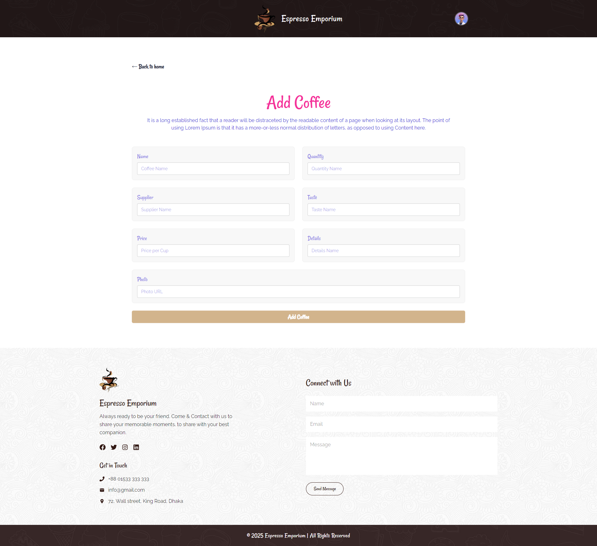
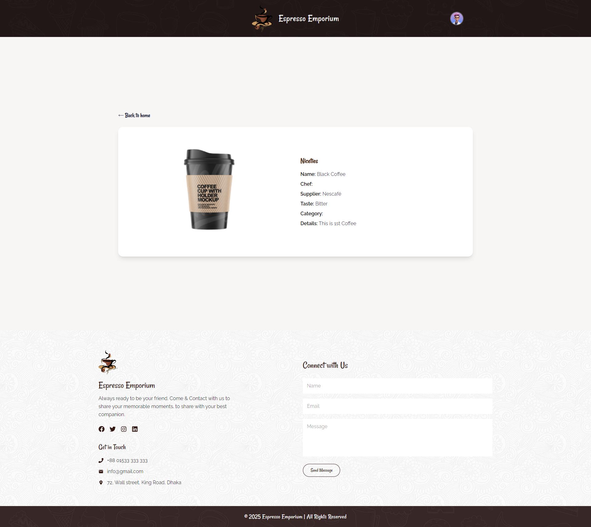
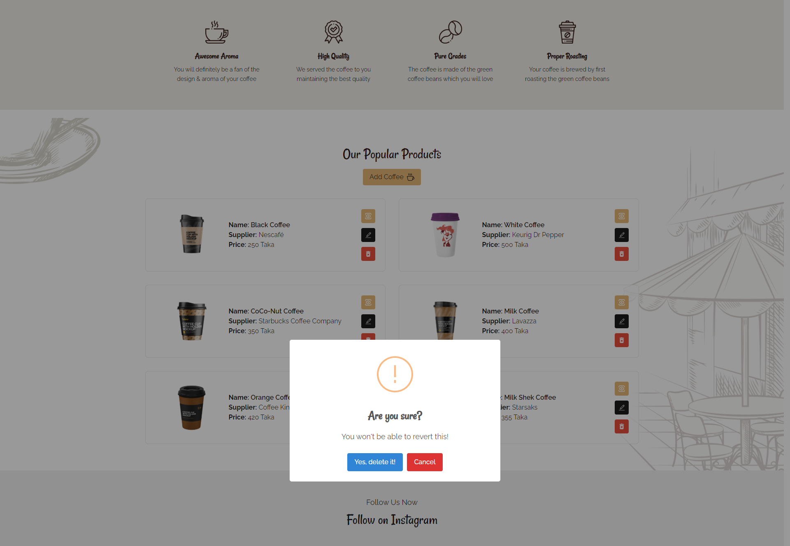
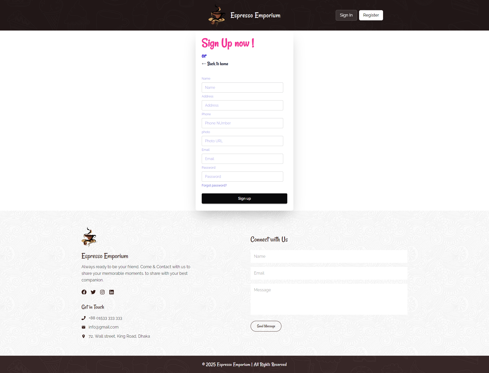

# ☕ Coffee Store – MERN Stack CRUD Project
A clean and simple **Coffee Shop Management Web Application** built with the full **MERN Stack**.
This project focuses mainly on **admin-side functionality**, including product management with full CRUD operations.
It is my **first complete MERN stack project**, showcasing authentication, protected routes, and a well-organized UI.

---
## 🚀 Live Demo

**🔗 Live Website:** [https://coffee-store-lyart.vercel.app/] (https://coffee-store-lyart.vercel.app/)

---
## 📸 Screenshots

---
## ✨ Features
**🔐 Authentication (Firebase Email/Password Auth)**
- Sign In / Sign Up functionality
- Protected admin routes
- Automatic redirect to Sign-In if a logged-in user becomes unauthenticated

**☕ Coffee Product Management (CRUD)**
Authenticated users can:
- ➕ Create a new coffee product
- 📝 Edit any coffee product
- ❌ Delete a coffee product
- 👀 View product details

**👥 Public User Experience**
Users who are not logged in can only see:
- Navbar
- Hero/Banner section
- Product list (read-only)
- Footer
Admin features remain hidden until the user signs in.
---
## 🛠️ Tech Stack
**Frontend (Client)**
- ⚛️ React
- 🔀 React Router DOM
- 🌐 Context API
- 🎨 Tailwind CSS
- 🌸 DaisyUI
- 🎉 SweetAlert2
- 🔐 Firebase Authentication

**Backend (Server)**
- 🟩 Node.js
- 🚂 Express.js
- 🍃 MongoDB (CRUD operations)

---

**🔒 Authentication Behavior Notes**
- Users must be logged in to access Create, Edit, and Delete pages.
- If the authentication token expires or a user logs out while on a protected page,
they will be auto-redirected to the Sign-In page.
- Admin-only UI elements remain hidden for non-authenticated users.

---
## 👨‍💻 Author

**Ziaul Hoque Patwary**  
📧 Email: [**ziaul.dev@gmail.com**] 
🔗 GitHub: [ziaul-hoque4820](https://github.com/ziaul-hoque4820)

---

**Thanks for visiting the project! Feel free to star ⭐ the repo or contribute.**